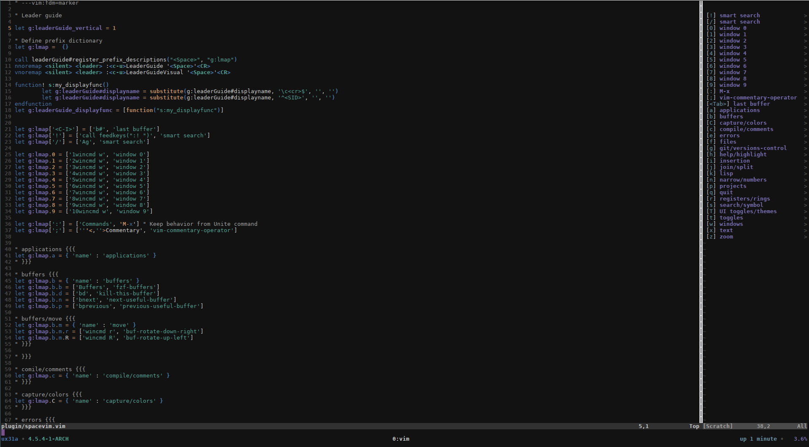

# Spacevim
*Spacemacs key bindings for vim*

Spacevim provides leader bindings to match most of [Spacemacs](https://github.com/syl20bnr/spacemacs) behaviour.

[colorscheme](https://github.com/ctjhoa/miro8)

##  Installation
This plugin follows the standard runtime path structure, and as such it can be installed with a variety of plugin managers:

*  [Pathogen](https://github.com/tpope/vim-pathogen)
  *  `git clone https://github.com/ctjhoa/spacevim ~/.vim/bundle/spacevim`
  *  Remember to run `:Helptags` to generate help tags
*  [NeoBundle](https://github.com/Shougo/neobundle.vim)
  *  `NeoBundle 'ctjhoa/spacevim'`
*  [Vundle](https://github.com/gmarik/vundle)
  *  `Plugin 'ctjhoa/spacevim'`
*  [Plug](https://github.com/junegunn/vim-plug)
  *  `Plug 'ctjhoa/spacevim'`
*  manual
  *  copy all of the files into your `~/.vim` directory

## Requirements
Spacevim relies on several other vim plugins for the key bindings implementations.
- [hecal3/vim-leader-guide](https://github.com/hecal3/vim-leader-guide) (Optional)
- [junegunn/fzf](https://github.com/junegunn/fzf)
- [junegunn/fzf.vim](https://github.com/junegunn/fzf.vim)
- [tpope/vim-commentary](https://github.com/tpope/vim-commentary)
- [tpope/vim-eunuch](https://github.com/tpope/vim-eunuch)
- [tpope/vim-fugitive](https://github.com/tpope/vim-fugitive)
