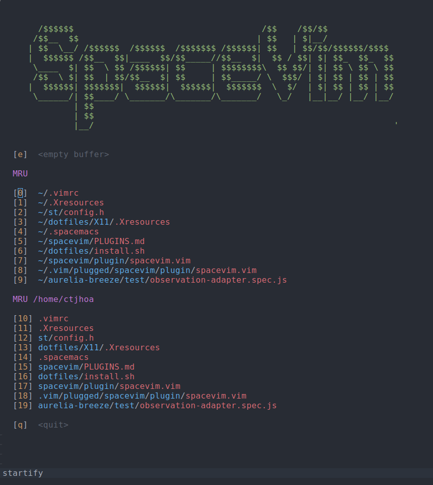
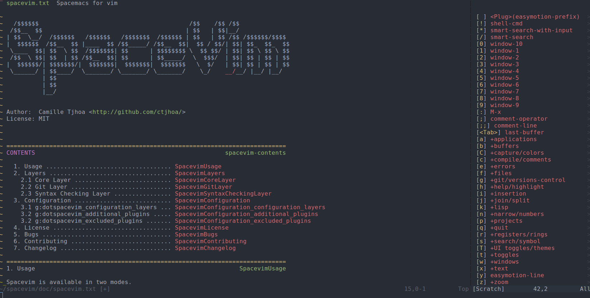

# Spacevim - Spacemacs for vim [](https://travis-ci.org/ctjhoa/spacevim)

This project is not actively maintained anymore. There are other projects doing similar things.

* [liuchengxu/space-vim](https://github.com/liuchengxu/space-vim)
* [SpaceVim/SpaceVim](https://github.com/SpaceVim/SpaceVim)

---

Spacevim is [Spacemacs](https://github.com/syl20bnr/spacemacs) for vim.
It can be used as a full distribution or you can get only the Spacemacs key bindings



[colorscheme](https://github.com/joshdick/onedark.vim)

## Installation

Spacevim provides 2 ways of using it. First you can use it as a vim distribution like Spacemacs.
Or you can only install it as a set of key bindings and Spacevim will bring out the best of your currently installed plugin.

### Distribution mode

You want a full vim distribution like Spacemacs provides for emacs.
Execute this line of shell, it will download a default `.vimrc` and install
plugins through vim.

```shell
curl -sSfL https://raw.githubusercontent.com/ctjhoa/spacevim/master/vimrc.sample -o ~/.vimrc && vim
```

After plugins installation restart vim.

### Key bindings only mode

You already have a vim config and/or want to manage your plugins yourself.
This mode will provide only Spacemacs key bindings and adapt Spacevim with currently installed plugins.
Install Spacevim as usual:

* [Pathogen](https://github.com/tpope/vim-pathogen)
  * `git clone https://github.com/ctjhoa/spacevim ~/.vim/bundle/spacevim`
  * Remember to run `:Helptags` to generate help tags
* [NeoBundle](https://github.com/Shougo/neobundle.vim)
  * `NeoBundle 'ctjhoa/spacevim'`
* [Vundle](https://github.com/gmarik/vundle)
  * `Plugin 'ctjhoa/spacevim'`
* [Plug](https://github.com/junegunn/vim-plug)
  * `Plug 'ctjhoa/spacevim'`
* manual
  * copy all of the files into your `~/.vim` directory

## Plugins

[see details](PLUGINS.md)

## TODO

* Load plugin in async
* Support spacemacs 0.200.X
* Better documentation
* OO programming (as suggested [here](https://www.reddit.com/r/vim/comments/4y8w38/spacevim_20_the_war_is_not_over/d6m1i02))

## License

MIT License


