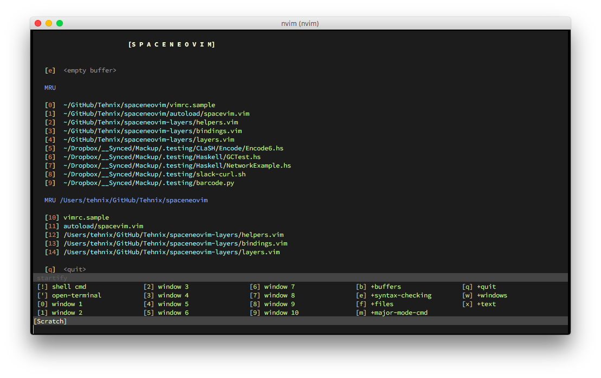

# SpaceNeovim - Spacemacs for Neovim [](https://travis-ci.org/Tehnix/spaceneovim)

SpaceNeovim is [Spacemacs](https://github.com/syl20bnr/spacemacs) for Neovim. If
you are unfamiliar with Spacemacs, you can read more about the motivation behind
that on their website.



## Installation

Prerequisites:

* `git` on your path (`brew install git`)
* `nvim` on your path (`brew install neovim/neovim --head`)
* Neovim python bindings (`pip install neovim` or `pip3`)

SpaceNeovim is a configurable distribution like Spacemacs.

__N.B.:__ Please __backup__ your `init.vim` first! Curl will overwrite the contents in the file (meaning it will also follow symlinks)!

To start using SpaceNeovim you can use the following oneliner,

```shell
mkdir -p ~/.config/nvim/ && curl -sSfL https://raw.githubusercontent.com/tehnix/spaceneovim/master/vimrc.sample -o ~/.config/nvim/init.vim | nvim
```

It will download a default `init.vim` which in turn takes care of setting up the
rest by:

* Downloading `autoload/spaceneovim.vim`
* Setting up [vim-plug](https://github.com/junegunn/vim-plug)
* Cloning down the [layers repository](https://github.com/Tehnix/spaceneovim-layers)
* Installing default plugins

## Layers

Go to the [layers repository](https://github.com/Tehnix/spaceneovim-layers) for
more information on the different layers.

To enable a layer, include it in `g:dotspaceneovim_configuration_layers` inside the `dotspaceneovim/init` block. For example, the following enables the `+checkers/syntax-checking` layer,

```viml
let g:dotspaceneovim_configuration_layers = [
\  '+checkers/syntax-checking'
\]
```

You can also add custom layers to `g:dotspaceneovim_additional_plugins`, which will be installed with `vim-plug`.

## Developing

To easily test your changes it is recommended to symlink the various files into your `.config/nvim` folder. The ones you want to replace are

* `.config/nvim/spaceneovim-layers` to test layer changes
* `.config/nvim/autoload/spaceneovim.vim` to test core changes
* `.config/nvim/init.vim` to test changes to `vimrc.sample`

### Using your own layer repository

If you want to develop/test out your own layers, there are two ways to do it:

1. Point to your own git repository with `g:spaceneovim_layers_repository`, e.g. `let g:spaceneovim_layers_repository = 'git@github.com:Tehnix/spaceneovim-layers.git'`. This needs to be set before `dotspaceneovim/auto-install`.
1. Manage the `spaceneovim-layers` directory yourself - the bootstrap process basically just checks if the directory exists, and if not it clones it down. Symlinking or putting in your own directory here will also work.

### Enable Debugging

You can enable debugging output by setting `let g:dotspaceneovim_debug = 1` in your `init.vim` file.

## License

See [LICENSE](LICENSE).
